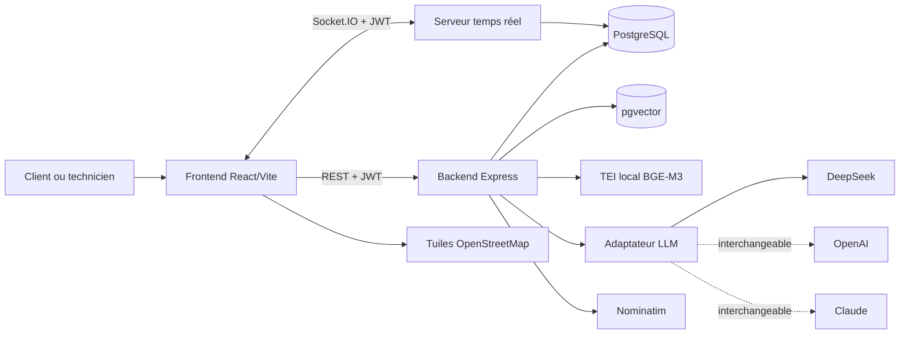
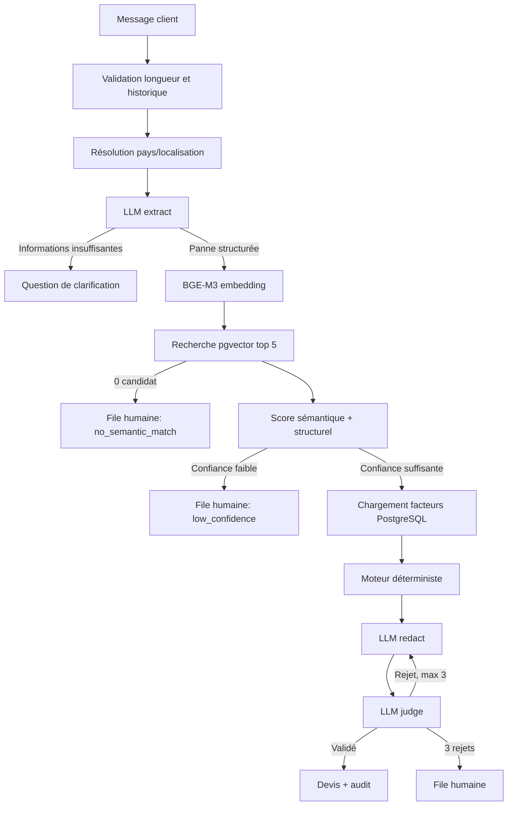
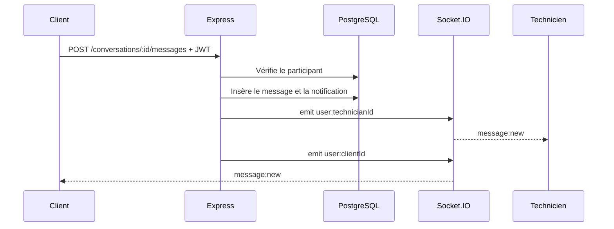

# Rapport technique complet — QuoteAI HVAC

**Date de l’état analysé :** 13 juillet 2026
**Projet :** plateforme de devis HVAC assistée par intelligence artificielle
**Périmètre :** frontend, backend, base PostgreSQL/pgvector, modèles IA, moteur de prix, carte, messagerie, sécurité, tests et exploitation

---

## 1. Résumé exécutif

QuoteAI est une application web mettant en relation des clients ayant un problème de chauffage, ventilation ou climatisation avec des techniciens HVAC. Elle permet principalement :

- de décrire une panne en langage naturel, en français ou dans une autre langue comprise par le LLM actif ;
- d’obtenir des questions de clarification lorsque la demande est insuffisante ;
- de rechercher les pannes les plus similaires dans un catalogue HVAC vectorisé ;
- de calculer un devis dans la monnaie du pays détecté ;
- de localiser des techniciens sur une vraie carte OpenStreetMap ;
- de contacter un technicien, afficher son téléphone et discuter avec lui en temps réel ;
- de gérer des rendez-vous, leads, disponibilités, tarifs et notifications ;
- d’évaluer un technicien après l’établissement d’une relation réelle par conversation ou rendez-vous.

L’architecture IA est volontairement hybride. Le grand modèle de langage ne calcule jamais directement le prix. Il sert à comprendre la demande, structurer les informations, rédiger le résultat et vérifier la fidélité du texte final. La recherche de pannes utilise un modèle d’embeddings local BGE-M3 et PostgreSQL/pgvector. Le montant est ensuite produit par des formules déterministes et des tables tarifaires contrôlées.

Cette séparation est importante : elle réduit le risque qu’un LLM invente un prix, une devise, une panne ou un coefficient.

---

## 2. Objectifs fonctionnels et acteurs

### 2.1 Client

Le client peut :

- créer un compte ou se connecter ;
- enregistrer son profil et sa position ;
- décrire une panne au chatbot ;
- recevoir un devis ou une demande de précision ;
- accepter, négocier ou refuser l’estimation ;
- rechercher les techniciens proches ;
- consulter leur distance, spécialités, disponibilité et note ;
- ouvrir une conversation et voir le numéro de téléphone du technicien ;
- envoyer et recevoir des messages en temps réel ;
- prendre un rendez-vous ;
- laisser ou modifier une évaluation après contact ou rendez-vous.

### 2.2 Technicien

Le technicien peut :

- configurer ses spécialisations, son rayon et sa disponibilité ;
- consulter ses leads entrants ;
- accepter ou décliner un lead ;
- communiquer avec ses clients ;
- consulter son agenda ;
- bloquer des créneaux ;
- gérer ou importer sa grille tarifaire ;
- finaliser une intervention et renseigner le prix réel ;
- consulter ses statistiques et sa note moyenne.

### 2.3 Système

Le système assure :

- l’authentification et l’autorisation ;
- l’orchestration du chatbot ;
- la recherche vectorielle ;
- le calcul déterministe ;
- la persistance des données métier ;
- les audits de devis ;
- les bascules vers une analyse humaine ;
- les notifications et événements temps réel.

---

## 3. Technologies utilisées

| Couche | Technologies principales | Rôle |
|---|---|---|
| Frontend | React 19, TypeScript, Vite 8 | Interface web client et technicien |
| Style et composants | Tailwind CSS, Lucide React | Mise en page, design et icônes |
| Requêtes HTTP | Axios | Communication REST avec le backend |
| Carte | Leaflet, React Leaflet, OpenStreetMap | Carte réelle et marqueurs géographiques |
| Temps réel frontend | Socket.IO Client | Réception immédiate des messages |
| Backend | Node.js 22, Express 5 | API REST et orchestration métier |
| Temps réel backend | Socket.IO | Rooms utilisateurs et diffusion des messages |
| Authentification | JWT, bcrypt | Sessions signées et mots de passe hachés |
| Sécurité HTTP | Helmet, CORS, express-rate-limit | En-têtes, origines et limites de débit |
| Base de données | PostgreSQL 16 | Données utilisateurs et métier |
| Recherche vectorielle | extension pgvector | Similarité cosinus sur les pannes HVAC |
| Embeddings actifs | BAAI/bge-m3, 1024 dimensions | Représentation sémantique multilingue |
| Serveur embeddings | Hugging Face Text Embeddings Inference CPU | API locale compatible OpenAI |
| LLM actif par défaut | DeepSeek Chat | Extraction, rédaction et contrôle |
| LLM alternatifs | OpenAI et Anthropic/Claude | Comparaison qualité/coût sans changer le métier |
| Géocodage | Nominatim/OpenStreetMap | Recherche et résolution de lieux |
| Conteneurs | Docker | PostgreSQL/pgvector et serveur embeddings |

---

## 4. Architecture générale



### 4.1 Principe de séparation

Le projet sépare quatre responsabilités IA et métier :

1. **Compréhension linguistique :** le LLM transforme le texte libre en JSON métier.
2. **Recherche sémantique :** BGE-M3 et pgvector retrouvent les pannes proches.
3. **Calcul financier :** le moteur de prix applique uniquement des formules et tables PostgreSQL.
4. **Présentation :** le LLM rédige le devis, puis un second passage le contrôle.

Le backend reste la source de vérité. Le frontend ne calcule pas le prix et ne choisit pas la devise.

---

## 5. Organisation du code

### 5.1 Backend

Les principaux répertoires sont :

- `backend/server.js` : serveur Express principal, routes métier, sécurité et démarrage Socket.IO ;
- `backend/routes/pricing.js` : endpoint du chatbot et construction de l’orchestrateur ;
- `backend/routes/conversations.js` : conversations et messages ;
- `backend/services/pricing/` : recherche, confiance, calcul, prompts, localisation et erreurs externes ;
- `backend/services/llm/` : interface LLM et adaptateurs fournisseurs ;
- `backend/services/geocoding.js` : intégration Nominatim et cache ;
- `backend/db/` : schémas, migrations et données de départ ;
- `backend/scripts/` : vectorisation du catalogue ;
- `backend/middleware/` : JWT et contrôle des rôles ;
- `backend/tests/` : tests unitaires du moteur et des clients IA.

### 5.2 Frontend

Les fichiers centraux sont :

- `frontend/src/app/App.tsx` : application, dashboards, chatbot, rendez-vous, leads et tarifs ;
- `frontend/src/app/TechnicianMap.tsx` : vraie carte Leaflet ;
- `frontend/src/app/ConversationsPanel.tsx` : interface de messagerie ;
- `frontend/src/lib/api.ts` : client Axios et ajout automatique du JWT ;
- `frontend/src/lib/socket.ts` : connexion Socket.IO authentifiée ;
- `frontend/src/styles/` : styles globaux ;
- `frontend/scripts/realtime-smoke.mjs` : test réel de messagerie et d’évaluation.

### 5.3 Observation d’architecture

Le backend et surtout `App.tsx` restent relativement monolithiques. Cela ne bloque pas le prototype, mais une version de production gagnerait à découper les routes et écrans par domaine : utilisateurs, rendez-vous, techniciens, leads, notifications et tarifs.

---

## 6. Architecture du chatbot et des modèles IA

### 6.1 Modèle de langage agnostique

L’orchestrateur ne dépend plus directement de DeepSeek. Il utilise l’interface métier suivante :

```text
extract()  -> comprendre et structurer la demande
redact()   -> rédiger un devis à partir d’un calcul imposé
judge()    -> vérifier que le texte respecte exactement le calcul
```

La fabrique `createLlmClient()` sélectionne le fournisseur à partir de `LLM_PROVIDER` :

| Valeur | Adaptateur | API utilisée |
|---|---|---|
| `deepseek` | `OpenAiCompatibleClient` | `/chat/completions` |
| `openai` | `OpenAiClient` | `/responses` |
| `anthropic` ou `claude` | `AnthropicClient` | `/messages` |

Les variables universelles sont :

```env
LLM_PROVIDER=deepseek
LLM_API_KEY=...
LLM_BASE_URL=https://api.deepseek.com
LLM_MODEL=deepseek-chat
```

Le fournisseur et le modèle peuvent donc changer sans modification de `PricingOrchestrator`, des formules de prix ou du schéma PostgreSQL.

### 6.2 Rôle du LLM

Le LLM réalise trois opérations distinctes.

### Extraction

Il reçoit :

- le dernier message ;
- les dix derniers éléments d’historique ;
- le pays résolu par le backend ;
- la date courante.

Il retourne un JSON contenant notamment :

- une ou plusieurs pannes ;
- la description normalisée ;
- le type d’intervention : réparation ou installation ;
- le type d’équipement ;
- la marque et l’âge si disponibles ;
- le pays ;
- l’urgence ;
- la complexité ;
- la saison ;
- la nécessité d’une clarification et la question correspondante.

Une salutation comme « hello » ne doit donc pas produire un prix. Elle produit `status = clarification` avec une question naturelle.

### Rédaction

Le LLM reçoit le JSON d’extraction et le calcul final. Il doit reproduire les chiffres, la devise et les pannes sans rien recalculer.

### Jugement

Un dernier appel compare le devis rédigé avec l’extraction et le calcul. Si le texte modifie un montant ou ajoute une panne, il est rejeté. Trois tentatives maximum sont autorisées avant transfert humain.

### 6.3 Modèle d’embeddings actif

Le modèle actif est :

```text
BAAI/bge-m3
Dimension de stockage : 1024
Serveur : Hugging Face TEI CPU
Endpoint local : http://127.0.0.1:8081/v1
```

BGE-M3 ne dialogue pas avec l’utilisateur et ne produit aucun prix. Il transforme uniquement une description de panne en vecteur numérique.

Le client :

1. ajoute une instruction de recherche à la requête ;
2. appelle `/embeddings` ;
3. vérifie que toutes les valeurs sont numériques ;
4. réduit le vecteur aux 1024 premières dimensions si nécessaire ;
5. normalise sa norme à 1 ;
6. associe le stockage au nom `BAAI/bge-m3:1024`.

Cette signature empêche de comparer accidentellement des embeddings issus de modèles ou dimensions différents.

Le fichier d’exemple propose également Qwen3-Embedding-8B pour une infrastructure GPU, mais l’installation actuellement opérationnelle utilise BGE-M3 sur CPU.

### 6.4 Recherche pgvector

Chaque panne du catalogue contient un vecteur `vector(1024)`. Pour une panne extraite, le backend exécute une recherche par distance cosinus :

```sql
1 - (embedding <=> requete) AS semantic_score
```

Les conditions sont :

- panne active ;
- embedding présent ;
- type d’intervention compatible si connu ;
- modèle d’embedding identique ;
- cinq candidats maximum.

Le meilleur candidat est ensuite soumis au calcul de confiance.

---

## 7. Pipeline complet d’un message chatbot



### Étapes détaillées

1. Le frontend envoie `text`, l’historique et éventuellement la position.
2. Le backend limite le texte à 4000 caractères et l’historique à 30 éléments.
3. Le pays est déterminé avant le calcul.
4. `extract()` interprète le message.
5. Si une précision manque, le backend retourne une question sans lancer les embeddings.
6. Pour chaque panne, BGE-M3 génère un vecteur.
7. pgvector recherche les pannes proches.
8. Le backend distingue l’absence totale de candidat d’une faible confiance.
9. Le score de confiance est calculé.
10. Le backend charge les coefficients correspondant au pays et au contexte.
11. Le moteur déterministe calcule chaque ligne.
12. `redact()` produit un texte lisible.
13. `judge()` valide la fidélité du texte.
14. Le résultat et les informations de contrôle sont audités.

---

## 8. Calcul de confiance

### 8.1 Score structurel

Le score structurel combine :

- correspondance du pays : 30 % ;
- correspondance du type d’intervention : 30 % ;
- correspondance du type d’équipement : 40 %.

Formule :

```text
structure = pays × 0,30 + intervention × 0,30 + équipement × 0,40
```

Chaque correspondance vaut 0 ou 1.

### 8.2 Score final d’une panne

```text
confiance_panne = similarité_sémantique × 0,60 + structure × 0,40
```

Le score est borné entre 0 et 1 et arrondi à quatre décimales.

### 8.3 Cas multi-pannes

Lorsqu’une demande comporte plusieurs pannes, la confiance globale est le minimum des confiances individuelles :

```text
confiance_cas = MIN(confiance_panne_1, ..., confiance_panne_n)
```

Le choix est prudent : une seule panne incertaine suffit à empêcher un devis trop affirmatif.

### 8.4 Routage

Les seuils par défaut sont stockés dans PostgreSQL :

| Confiance | Décision |
|---|---|
| ≥ 0,70 | devis automatique, confiance haute |
| ≥ 0,50 et < 0,70 | devis automatique avec fourchette élargie |
| < 0,50 | analyse humaine |

---

## 9. Moteur déterministe de tarification

### 9.1 Données d’entrée

Le calcul utilise :

- coût de base des pièces en USD ;
- nombre d’heures estimées ;
- taux de change local par USD ;
- taux horaire local ;
- ajustement régional de main-d’œuvre ;
- multiplicateur d’urgence ;
- multiplicateur de complexité ;
- multiplicateur saisonnier ;
- marge fixe ;
- éventuellement le coût d’un équipement et son facteur d’importation.

### 9.2 Formules

```text
pièces = coût_pièces_USD × taux_change
```

```text
main_oeuvre = heures
             × taux_horaire_local
             × ajustement_régional
             × multiplicateur_urgence
             × multiplicateur_complexité
             × multiplicateur_saison
```

```text
marge = marge_fixe_USD × taux_change
```

```text
équipement = coût_équipement_USD
             × taux_change
             × facteur_importation
```

```text
total_ligne = pièces + main_oeuvre + marge + équipement
```

Pour plusieurs pannes, la marge fixe n’est appliquée que sur la première ligne afin de ne pas multiplier les frais de déplacement ou administratifs.

### 9.3 Fourchette

- confiance haute : ± 8 % autour du total ;
- confiance moyenne : ± 20 %.

Le LLM reçoit cette structure déjà calculée et n’a pas l’autorisation de modifier les nombres.

### 9.4 Exemple réel validé

Un test réel pour un climatiseur split dont le compresseur ne démarre pas à Sfax a produit :

```text
Pays : Tunisie
Devise : TND
Total : 496,40 TND
```

---

## 10. Localisation et monnaie

### 10.1 Priorité de résolution du pays

Le pays est recherché dans cet ordre :

1. lieu explicitement mentionné dans le message ;
2. pays explicitement envoyé par le frontend ;
3. ville de la localisation instantanée ;
4. coordonnées GPS instantanées ;
5. ville du profil ;
6. coordonnées du profil.

Ainsi, « panne à Sfax » impose la Tunisie même si le profil est enregistré dans un autre pays.

Le résolveur connaît les principales villes de Tunisie, Algérie, Maroc, Libye, Égypte et plusieurs pays du Moyen-Orient.

### 10.2 Devise

La devise ne vient pas du frontend. Elle provient de `pricing_regions`, après résolution du pays. La table contient notamment :

- code et nom de devise ;
- taux de change ;
- taux horaire local ;
- ajustement régional ;
- facteur d’importation.

La base réelle contient actuellement 14 régions tarifaires.

### 10.3 Géocodage

Le service Nominatim assure :

- le géocodage direct d’un nom vers latitude/longitude ;
- le géocodage inverse des coordonnées vers la ville et le quartier.

Mesures intégrées :

- une requête maximum par seconde ;
- file séquentielle ;
- timeout de huit secondes ;
- cache mémoire de 24 heures ;
- User-Agent identifiable ;
- repli local pour plusieurs villes connues.

---

## 11. Carte et calcul des distances

La carte utilise React Leaflet avec les tuiles OpenStreetMap et l’attribution obligatoire.

Fonctionnalités :

- position réelle du client ;
- marqueurs techniciens basés sur leurs coordonnées PostgreSQL ;
- ajustement automatique des limites de carte ;
- recentrage sur le technicien sélectionné ;
- différenciation disponible/indisponible ;
- popup avec spécialité, distance et bouton de contact ;
- filtres par disponibilité, spécialisation et recherche textuelle.

La distance backend utilise la formule de Haversine avec un rayon terrestre de 6371 km. Il s’agit d’une distance géodésique à vol d’oiseau, et non d’un itinéraire routier. Un moteur de routage serait nécessaire pour afficher une durée ou une distance par route.

Un technicien sans coordonnées valides n’est pas placé arbitrairement. La distance est affichée comme indisponible.

---

## 12. Messagerie temps réel

### 12.1 Stockage

La messagerie utilise deux tables :

- `conversations` : relation unique client–technicien ;
- `conversation_messages` : expéditeur, texte, date et lecture.

### 12.2 Sécurité

- le client doit être authentifié pour créer une conversation ;
- le destinataire doit être un technicien existant ;
- seuls les deux participants peuvent lire et écrire ;
- le contenu est limité à 2000 caractères ;
- le débit est limité à 30 messages par minute ;
- le téléphone du correspondant est retourné dans le contexte de conversation ;
- Socket.IO vérifie le JWT lors de la connexion.

### 12.3 Temps réel



Dans l’interface, l’ID de l’expéditeur et l’ID courant sont convertis en nombres avant comparaison. Les messages de l’utilisateur courant sont alignés à droite ; ceux du correspondant à gauche.

---

## 13. Évaluations des techniciens

Les avis sont stockés dans `technician_ratings` avec une contrainte unique par couple client–technicien.

Règles :

- note entière de 1 à 5 ;
- commentaire jusqu’à 2000 caractères ;
- un client peut modifier son avis ;
- le client doit avoir une conversation ou un rendez-vous avec le technicien ;
- un utilisateur sans relation reçoit une erreur 403 ;
- la moyenne et le nombre d’avis sont recalculés après chaque modification.

Les avis provenant des rendez-vous existants sont migrés vers la table dédiée. Lorsqu’un rendez-vous existe, l’évaluation peut également être recopiée sur celui-ci pour conserver l’historique métier.

---

## 14. Rendez-vous, disponibilités et leads

### Rendez-vous

La table `appointments` conserve : client, technicien, date, heure, service, panne, prix estimé, prix réel, statut, adresse, description, note et commentaire.

Les règles d’autorisation empêchent un client de déclarer lui-même une intervention terminée ou de renseigner le prix réel. Le technicien gère l’avancement et le compte-rendu ; le client peut notamment annuler ou confirmer un prix.

### Créneaux bloqués

Les techniciens peuvent définir :

- une date précise ;
- un blocage quotidien ;
- certains jours de la semaine ;
- une plage horaire et un motif.

### Leads

Les leads contiennent la panne, le prix, la confiance, la ville et le statut. Un technicien peut accepter ou décliner. En cas de refus, le backend cherche un autre technicien disponible ayant la spécialité correspondante.

---

## 15. Base de données

### 15.1 Tables applicatives

| Table | Rôle |
|---|---|
| `users` | comptes clients et techniciens |
| `technician_profiles` | spécialités, rayon, disponibilité et agrégats d’avis |
| `price_items` | grille tarifaire personnelle du technicien |
| `blocked_slots` | indisponibilités |
| `leads` | demandes envoyées aux techniciens |
| `appointments` | rendez-vous et résultats d’intervention |
| `notifications` | notifications utilisateur |
| `conversations` | relation de messagerie client–technicien |
| `conversation_messages` | messages persistants |
| `technician_ratings` | avis uniques client–technicien |

### 15.2 Tables de tarification et IA

| Table | Rôle |
|---|---|
| `pricing_faults` | catalogue des pannes et embeddings |
| `pricing_urgency_multipliers` | coefficients d’urgence |
| `pricing_complexity_multipliers` | coefficients de complexité |
| `pricing_season_multipliers` | coefficients saisonniers |
| `pricing_regions` | monnaies et paramètres régionaux |
| `pricing_fixed_margins` | marges par intervention |
| `pricing_equipment_costs` | coûts moyens d’équipements |
| `pricing_historical_cases` | cas réels et résultats validés |
| `pricing_system_config` | seuils et paramètres système |
| `pricing_quote_audits` | traçabilité des décisions |
| `pricing_fallback_requests` | demandes nécessitant une analyse humaine |

### 15.3 Volumes observés

| Donnée | Volume actuel |
|---|---:|
| Utilisateurs | 10 |
| Profils techniciens | 6 |
| Pannes catalogue | 250 |
| Pannes vectorisées | 250 |
| Modèle stocké | `BAAI/bge-m3:1024` |
| Régions tarifaires | 14 |
| Rendez-vous | 4 |
| Conversations | 3 |
| Messages | 13 |
| Évaluations | 3 |
| Audits de devis | 16 |
| Replis humains en attente | 0 |

---

## 16. API backend principale

### Authentification et profils

| Méthode | Route | Fonction |
|---|---|---|
| POST | `/register` | inscription |
| POST | `/login` | connexion |
| GET | `/me` | utilisateur courant |
| PATCH | `/users/:id` | modification de son profil |

### Techniciens

| Méthode | Route | Fonction |
|---|---|---|
| GET | `/technicians` | liste, distances et droit d’évaluer |
| GET | `/technicians/:id` | détail technicien |
| PATCH | `/technicians/:id` | profil technicien propriétaire |
| GET | `/technicians/me/stats` | statistiques du technicien |
| POST | `/technicians/:id/ratings` | création ou modification d’un avis |

### Chatbot et devis

| Méthode | Route | Fonction |
|---|---|---|
| POST | `/api/pricing/quote` | pipeline IA complet |
| POST | `/chat/counter-offer` | contre-offre simplifiée |
| POST | `/chat/quote` | ancien endpoint désactivé, HTTP 410 |

### Messagerie

| Méthode | Route | Fonction |
|---|---|---|
| GET | `/conversations` | liste des conversations accessibles |
| POST | `/conversations` | ouvrir une conversation client–technicien |
| GET | `/conversations/:id/messages` | historique autorisé |
| POST | `/conversations/:id/messages` | envoyer un message |

### Métier

Le backend contient également les routes de rendez-vous, feedback, créneaux bloqués, tarifs, notifications, leads et géocodage.

---

## 17. Sécurité

### 17.1 Authentification

- mots de passe hachés avec bcrypt ;
- JWT signé en HS256 ;
- issuer et audience vérifiés ;
- durée configurable ;
- format `Bearer` strict ;
- contrôle d’identité pour les modifications ;
- contrôle de rôle sur les routes sensibles.

### 17.2 HTTP et entrées

- Helmet et suppression de `X-Powered-By` ;
- CORS limité aux origines configurées ;
- JSON limité à 100 Ko ;
- limites de débit globales et spécifiques ;
- validations des emails, mots de passe, rôles, coordonnées et textes ;
- requêtes PostgreSQL paramétrées ;
- messages internes masqués dans le gestionnaire d’erreurs global ;
- import tarifaire CSV limité à 1 Mo et 1000 lignes ;
- suppression de la dépendance `xlsx` vulnérable.

### 17.3 Temps réel

- JWT validé à la poignée de main Socket.IO ;
- room privée `user:<id>` ;
- contrôle serveur de la participation à chaque conversation.

### 17.4 Audit des dépendances

Le dernier audit npm exécuté indiquait zéro vulnérabilité connue pour les dépendances de production frontend et backend.

---

## 18. Gestion des erreurs et continuité

Le client HTTP externe effectue deux nouvelles tentatives, donc trois essais au total, avec délais exponentiels de 250 puis 500 ms.

Les erreurs retentées sont :

- timeout ;
- erreur réseau ;
- HTTP 408 ;
- HTTP 429 ;
- HTTP 5xx.

| Situation | Code métier | Comportement |
|---|---|---|
| LLM indisponible à l’extraction | `llm_unavailable` | demande enregistrée pour traitement humain |
| LLM indisponible après calcul | `llm_unavailable_after_calculation` | contrôle humain |
| Embeddings indisponibles | `embedding_unavailable` | aucun faux résultat vectoriel |
| pgvector indisponible | `vector_search_unavailable` | repli humain |
| Aucun candidat | `no_semantic_match` | nouveau cas à analyser |
| Candidat peu fiable | `low_confidence` | confirmation humaine |
| Trois rédactions rejetées | `judge_validation_failed` | contrôle humain |

Le système ne renvoie pas un ancien devis depuis un cache, car la localisation, la monnaie et les coefficients peuvent être différents.

Chaque repli tente d’écrire :

- un audit dans `pricing_quote_audits` ;
- une demande en attente dans `pricing_fallback_requests`.

`Promise.allSettled` évite qu’une erreur d’audit masque la réponse adressée au client.

---

## 19. Tests et validations

La suite backend comporte actuellement 23 scénarios répartis dans huit fichiers.

Domaines couverts :

- pondération de confiance et stratégie multi-pannes ;
- parsing JSON des réponses LLM ;
- normalisation des embeddings ;
- identification du modèle d’embedding ;
- interface commune DeepSeek/OpenAI/Anthropic ;
- protocole spécifique de chaque fournisseur ;
- reconnaissance de Djerba et Sfax ;
- priorité message/GPS/profil ;
- clarification d’une salutation ;
- message vide ;
- panne LLM ;
- panne embeddings ;
- distinction zéro résultat/faible confiance ;
- formule du devis tunisien ;
- fourchettes de prix ;
- marge fixe unique.

Le test temps réel vérifie :

- création d’une conversation ;
- présence du téléphone ;
- réception Socket.IO ;
- visibilité côté technicien ;
- refus d’un avis sans relation ;
- succès d’un avis autorisé.

Les dernières vérifications ont également validé :

- lint frontend ;
- build Vite de production ;
- initialisation de la base ;
- backend HTTP 200 ;
- frontend HTTP 200 ;
- réponse réelle du chatbot sans `Forbidden` ;
- devis réel DeepSeek/BGE-M3 en TND.

---

## 20. Déploiement et démarrage local

### Services nécessaires

```text
Frontend Vite              127.0.0.1:5174
Backend Express/Socket.IO  127.0.0.1:5000
PostgreSQL/pgvector        127.0.0.1:5433
TEI BGE-M3                 127.0.0.1:8081
```

### Commandes

```powershell
cd backend
npm run db:init
npm test
npm start
```

```powershell
cd frontend
npm run lint
npm run dev
```

Il ne faut lancer qu’une seule instance backend sur le port 5000 et une seule instance Vite sur le port 5174. Sinon Node ou Vite retourne `EADDRINUSE`.

### Variables sensibles

Le fichier `.env` contient les secrets et ne doit pas être commité. `.env.example` fournit uniquement le modèle de configuration.

---

## 21. État de maturité

### Éléments opérationnels

- authentification et profils ;
- chatbot avec clarification dynamique ;
- DeepSeek actif et fournisseurs interchangeables ;
- BGE-M3 local ;
- catalogue entièrement vectorisé ;
- recherche pgvector ;
- moteur de prix multi-pays ;
- vraie monnaie locale ;
- vraie carte et géocodage ;
- distances géodésiques ;
- messagerie persistée et temps réel ;
- téléphone du technicien ;
- évaluations persistées ;
- sécurité et limites de débit ;
- tests unitaires et smoke test.

### Éléments encore partiellement prototypes

1. **Créneaux proposés par le chatbot :** les heures affichées dans le frontend sont générées à partir de valeurs fixes. La fonction backend de disponibilité existe, mais elle n’est pas encore branchée au parcours de réservation.
2. **Confirmation SMS :** l’interface annonce un SMS, mais aucun fournisseur SMS réel n’est intégré.
3. **Contre-offre :** l’endpoint retourne actuellement le montant reçu sans vrai workflow d’acceptation technicien.
4. **File humaine :** les demandes sont persistées, mais il manque un dashboard d’assignation et de résolution.
5. **Routage cartographique :** la distance est à vol d’oiseau, pas routière.
6. **Taux de change :** les valeurs proviennent de la base et ne sont pas automatiquement actualisées par une source financière.
7. **Pagination des messages :** l’historique est limité aux 500 premiers résultats sans pagination complète.
8. **Scalabilité temps réel :** Socket.IO utilise la mémoire du processus. Plusieurs instances nécessiteraient un adaptateur Redis.
9. **Rate limiting distribué :** les compteurs actuels sont en mémoire et devraient passer dans Redis en production multi-instance.
10. **JWT frontend :** le token est dans `localStorage`. Des cookies HttpOnly/Secure seraient préférables pour une exposition Internet sensible.
11. **Frontend monolithique :** `App.tsx` devrait être découpé et chargé dynamiquement ; le build signale encore un bundle principal supérieur à 500 Ko.
12. **Cartographie publique :** Nominatim et les tuiles OSM publiques n’offrent pas de SLA de production.
13. **Tests navigateur :** il manque une suite Playwright/Cypress complète malgré le smoke test réseau.

---

## 22. Recommandations prioritaires

### Priorité 1 — Fiabilité métier

- connecter les créneaux affichés à la disponibilité backend réelle ;
- supprimer la mention SMS ou intégrer un fournisseur réel ;
- construire l’interface opérateur pour les replis humains ;
- créer un véritable workflow de négociation ;
- ajouter des sources et dates de mise à jour aux paramètres régionaux.

### Priorité 2 — Sécurité production

- HTTPS obligatoire derrière un reverse proxy ;
- cookies HttpOnly/Secure ou stratégie complète contre le vol de JWT ;
- rotation des secrets ;
- Redis pour rate limiting et Socket.IO ;
- journalisation structurée avec identifiant de requête ;
- sauvegardes PostgreSQL et tests de restauration ;
- politique de rétention des messages, positions et audits.

### Priorité 3 — Qualité IA

- constituer un jeu d’évaluation multilingue français/arabe ;
- mesurer précision d’extraction, rappel du top 5 et erreurs de devise ;
- comparer DeepSeek, GPT et Claude avec les mêmes cas ;
- enregistrer coût, latence et taux de rejet par fournisseur ;
- enrichir `pricing_historical_cases` après validation des interventions ;
- tester Qwen3-Embedding-8B sur GPU puis comparer à BGE-M3.

### Priorité 4 — Expérience utilisateur

- distance et durée routières ;
- pagination et pièces jointes de messagerie ;
- indicateur « en train d’écrire » et présence ;
- accusés de lecture visibles ;
- affichage d’erreur explicite lors d’un échec d’évaluation ;
- découpage du bundle frontend et écrans mobiles dédiés.

---

## 23. Conclusion

Le projet dispose désormais d’un socle technique cohérent pour un prototype avancé ou un pilote contrôlé. Son principal point fort est la séparation entre compréhension IA, recherche sémantique et calcul financier déterministe. Le LLM n’est pas la source de vérité des prix ; PostgreSQL et le moteur de calcul le sont.

L’architecture est également indépendante du fournisseur LLM, multilingue grâce à BGE-M3, compatible avec une localisation réelle, et complétée par une messagerie temps réel sécurisée par JWT.

Avant une ouverture publique à grande échelle, les priorités sont de finaliser les parcours encore simulés, mettre en place l’exploitation de la file humaine, renforcer le déploiement distribué et développer une évaluation IA reproductible. Dans son état actuel, le système permet déjà de démontrer le parcours essentiel : comprendre une panne, chercher un cas similaire, calculer un devis local, trouver un technicien, communiquer avec lui et enregistrer le retour client.
